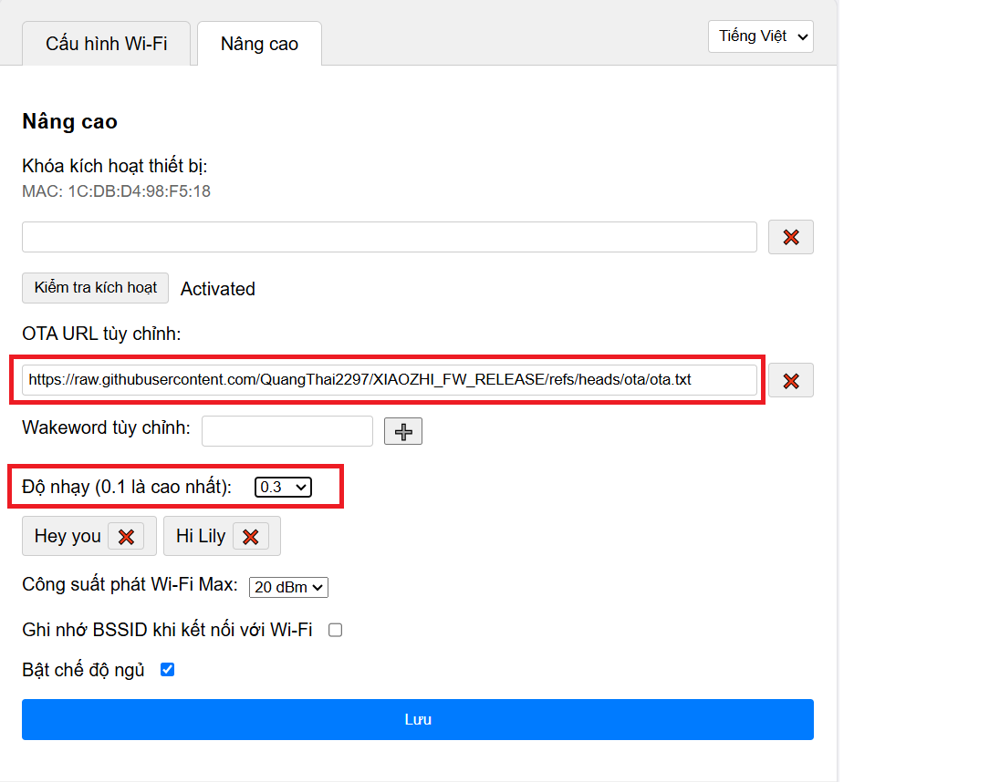
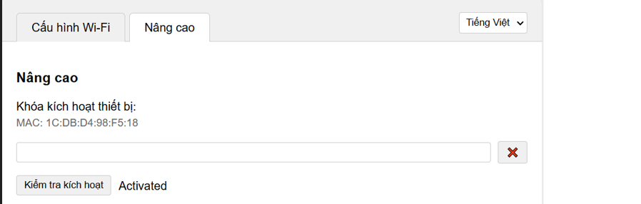

# Hướng dẫn nạp code cho board ESP32-S3 Breadboard chạy firmware chat bot AI XIAOZHI 
 Quá trình nạp firmware cho board **ESP32-S3 Breadboard**, sử dụng **ESP Launchpad Web Flasher** của Espressif.

 **Release version** : 
 
 **3.0.0**
 
 - Cập nhật phát nhạc tiếng Việt 

 - Tùy chỉnh wakeword thông qua cấu hình webserver
 
   Có thể thêm hoặc bớt nhiều từ đánh thức tùy ý (hiện tại chỉ nên đặt tiếng Anh, hoặc từ phát âm giống tiếng Anh)

 - Firmware file:
    - `esp32s3_bread_board_oled128x32_3-0-0.bin`
    - `esp32s3_bread_board_oled128x64_3-0-0.bin`

 **3.0.1**

 - Thêm cấu hình độ nhạy cho wakeword, chọn trong list có sẵn, hoặc các bạn tự điền từ mới, ví dụ: Hi John, Hi Mommy,...
 
   Với 1 số từ dễ bị nhận nhầm trong quá trình chạy, nên giảm độ nhạy xuống cho phù hợp

 - Tự động cập nhật firmware mới không cần nạp thủ công. 
 
    Lưu ý: để tự động cập nhật firmware các bạn cần thêm đường dẫn sau vào OTA URL: `https://raw.githubusercontent.com/QuangThai2297/XIAOZHI_FW_RELEASE/refs/heads/ota/ota.txt`

    ( Nếu không muốn tự động cập nhật, có thể bỏ qua lưu ý này )

    
 - Firmware file: 
    - `esp32s3_bread_board_oled128x64_3-0-1.bin`

    
 **3.0.2**

 - Tự động cập nhật firmware mới không cần nạp thủ công (xem note ở 3.0.1)

 - Fix lỗi OTA `dịch vụ không khả dụng ` ở bản 3.0.1

 - Thêm yêu cầu chatbot lấy tin mới từ báo VnExpress, và yêu cầu đọc chi tiết thông tin bài báo đó. Ví dụ: `Lấy cho cho mình 3 tin mới nhất hôm nay`,  `Lấy cho cho mình 3 tin mới nhất về giáo dục/pháp luật/thể thao/kinh tế/khoa học,...`, `Cho mình 2 tin tiếp theo`, `Cho mình chi tiết về tin ...`

 - Lấy giá vàng SJC, PNJ, DOJI. Ví dụ `cho mình thông tin giá vàng SJC`

 - Thêm hẹn giờ báo thức, thêm báo thức sau bao nhiêu phút/giây, hoặc thêm cụ thể giờ phút nào. Ví dụ `Hẹn cho mình sau 1 phút 30 giây đi đánh răng`, ` Hẹn cho mình lúc 23 giờ 15 phút đi ngủ` ` xóa tất cả báo thức cho mình `, ` mình đang có những báo thức nào `

   Đến giờ hẹn thì sẽ có nhạc chuông. bạn có thể dừng bằng cách ấn nút hoặc gọi wakeword
   

 - Firmware file: 
    - `esp32s3_bread_board_oled128x64_3-0-2.bin`
---

## 1️⃣ Giới thiệu board

**Mặt trước:**

**Mặt sau:**

Board có thể kết nối trực tiếp với máy tính qua cổng USB-C, và tương thích với các phiên bản màn hình oled 128*64

## 2️⃣ Nạp code qua ESP Launchpad

Truy cập trang chính thức:
👉 **[ESP Launchpad](https://espressif.github.io/esp-launchpad/)**

---

### **Bước 1: Cấu hình tool**

Chọn đúng model chip **ESP32-S3**, chọn cổng USB tương ứng, và baudrate mong muốn (khuyến nghị **921600**).

---

### **Bước 2: Kết nối board**

Nhấn **Connect**, chọn đúng thiết bị (ví dụ: `USB JTAG/serial debug unit`).

---

### **Bước 3: Flash firmware**

Chọn file `.bin` tương ứng với kích thước OLED bạn đang sử dụng, địa chỉ **0x0**, sau đó nhấn **Program**.

---

### **Bước 4: Hoàn tất**

Bạn nhìn nó hiện ra dòng ở dưới cùng như bên dưới là nạp thành công. Sau đó có thể ấn **Reset Device** để khởi động lại chip và chạy.

---

## 3️⃣ Lưu ý

 - Firmware sau khi nạp xong sẽ yêu cầu key active, các bạn liên hệ gửi mình mã MAC, sau đó mình sẽ gửi lại key cho các bạn. Key có thể được sử dụng nhiều lần trên cùng 1 thiết bị. Hiện tại hoàn toàn free.
 
 

 - Nếu bạn ấn **Program** mà không hiện ra màn hình nạp thì ấn vào **Console** trên thanh công cụ.

### Video hướng dẫn

- https://vt.tiktok.com/ZSUSVeWUb/

### Liên hệ
- Thai NG
- 0348819175