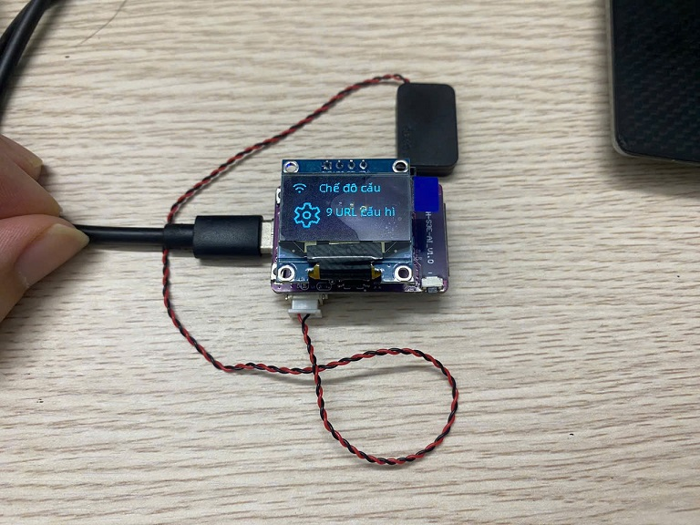
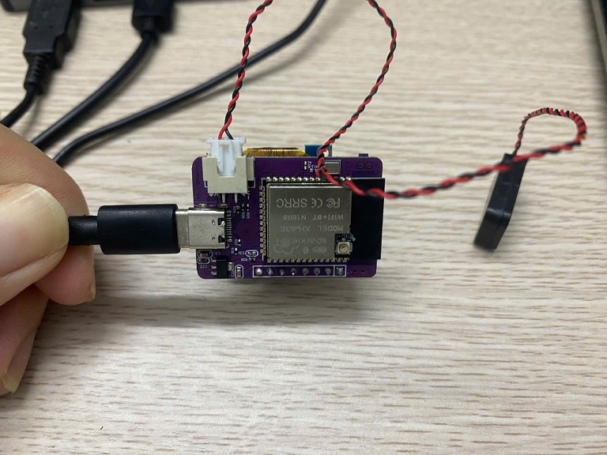
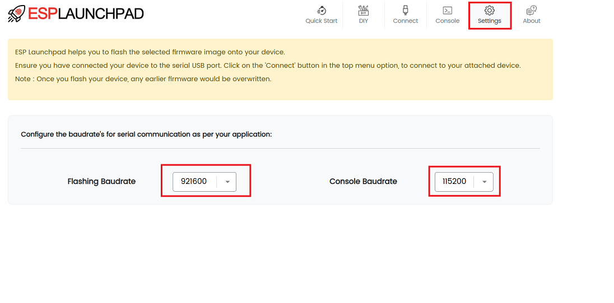
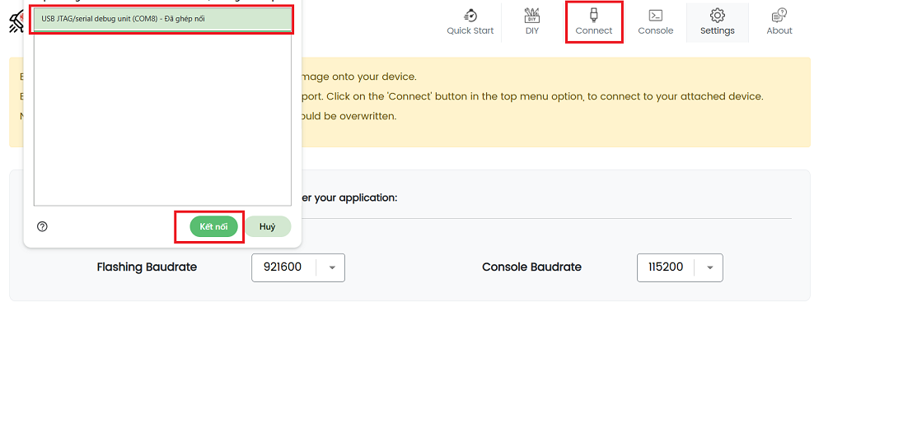
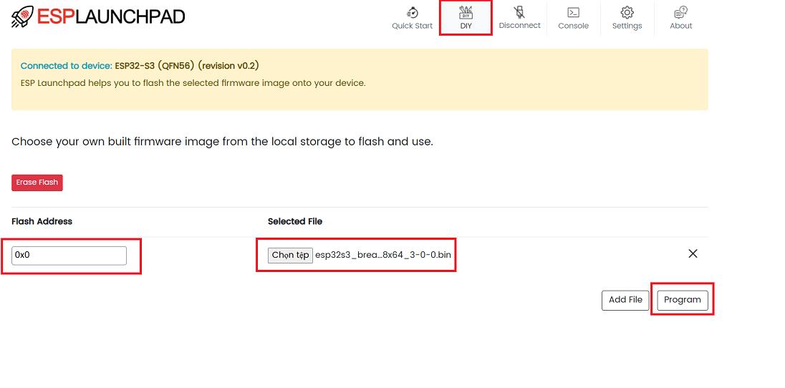
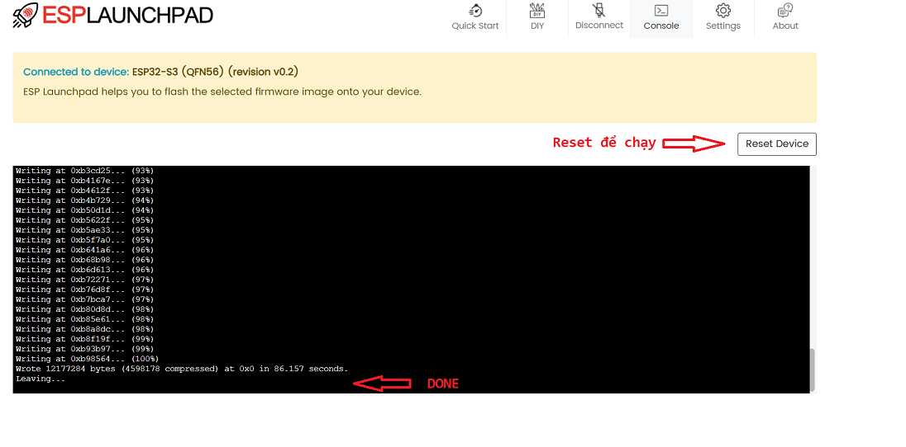

# Hướng dẫn nạp code cho board ESP32-S3 Breadboard chạy firmware chat bot AI XIAOZHI 
 Quá trình nạp firmware cho board **ESP32-S3 Breadboard**, sử dụng **ESP Launchpad Web Flasher** của Espressif.

 **Release version** : 3.0.0
 
 - Cập nhật phát nhạc tiếng Việt 

 - Tùy chỉnh wakeword thông qua cấu hình webserver

---

## 1️⃣ Giới thiệu board

**Mặt trước:**

**Mặt sau:**

Board có thể kết nối trực tiếp với máy tính qua cổng USB-C, và tương thích với các phiên bản firmware dành cho màn hình OLED:
- `esp32s3_bread_board_oled128x32_3-0-0.bin`
- `esp32s3_bread_board_oled128x64_3-0-0.bin`

---

## 2️⃣ Nạp code qua ESP Launchpad

Truy cập trang chính thức:
👉 **[ESP Launchpad](https://espressif.github.io/esp-launchpad/)**

---

### **Bước 1: Cấu hình tool**

Chọn đúng model chip **ESP32-S3**, chọn cổng USB tương ứng, và baudrate mong muốn (khuyến nghị **921600**).

---

### **Bước 2: Kết nối board**

Nhấn **Connect**, chọn đúng thiết bị (ví dụ: `USB JTAG/serial debug unit`).

---

### **Bước 3: Flash firmware**

Chọn file `.bin` tương ứng với kích thước OLED bạn đang sử dụng, địa chỉ **0x0**, sau đó nhấn **Program**.

---

### **Bước 4: Hoàn tất**

Bạn nhìn nó hiện ra dòng ở dưới cùng như bên dưới là nạp thành công. Sau đó có thể ấn **Reset Device** để khởi động lại chip và chạy.

---

## 3️⃣ Lưu ý

 - Nếu bạn ấn **Program** mà không hiện ra màn hình nạp thì ấn vào **Console** trên thanh công cụ.

### Video hướng dẫn

- https://vt.tiktok.com/ZSUSVeWUb/

### Liên hệ
- Thai NG
- 0348819175